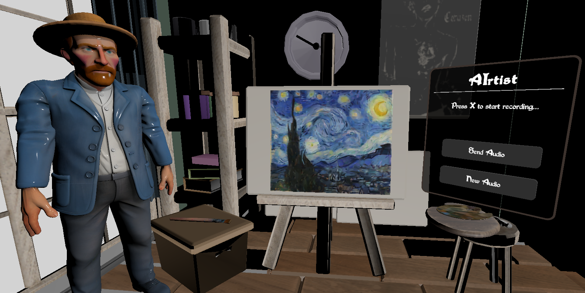

# 🎨 AIrtist — Simulador de Pintura em Realidade Virtual

**AIrtist** é um simulador em Realidade Virtual (VR) focado em proporcionar uma experiência **natural, guiada e imersiva de pintura**, permitindo que o usuário **recrie passo a passo obras icônicas de artistas famosos**.  
Na versão atual, o projeto é inteiramente dedicado a **Vincent van Gogh**, utilizando obras pré-geradas como base para a experiência.

  

---

## 🖼️ Obras Disponíveis (Pré-geradas)

Atualmente, o usuário pode escolher entre **três obras de Van Gogh**, previamente processadas pelo sistema:

- **The Starry Night (1889)**
- **Valley with Ploughman Seen from Above (1889)**
- **Wheatfield with Crows (1890)**

Essas obras foram utilizadas como base inicial para validar o fluxo de pintura guiada, análise de regiões e interação em VR.

---

## 🗣️ Explicação Artística e Narrativa

Para as **obras pré-geradas de Van Gogh**, o usuário passa por um momento inicial de explanação:

### 📚 Conteúdo Explicado
- Quem foi **Vincent van Gogh**
- O estilo artístico do autor
- O contexto histórico e emocional da obra
- O que inspirou a pintura
- Como ela foi produzida

---

## 🎙️ Geração de Novas Obras por Áudio

Além das obras pré-geradas, o **AIrtist** permite:

- Criar uma **nova obra a partir de áudio**;
- O usuário descreve verbalmente a obra desejada, pressionando o **botão Y** no Joystick do Meta Quest para iniciar a gravação. A gravação é encerrada ao soltar o botão;
- A pintura é gerada automaticamente;
- A nova obra é **adicionada à lista de obras disponíveis**;
- O usuário pode pintá-la normalmente;

⚠️ **Observação:**  
Para obras geradas via áudio, **não há momento de explanação artística**, pois:
- A obra pode ser de qualquer artista
- O sistema de explanação está, no momento, **restrito a Van Gogh**

---

## 🖌️ Experiência do Usuário (Fluxo em VR)

O fluxo da experiência no **Meta Quest** é o seguinte:

1. **Seleção da Obra**
   - O usuário escolhe uma das 3 obras pré-geradas de Van Gogh.
   -    **ou**
   - Criar uma nova obra via áudio (API)

2. **Explanação Contextual** (Apenas para as pré-geradas)
   - Introdução ao **artista (Vincent van Gogh)**;
   - Contexto histórico e artístico da obra:
     - Inspirações
     - Técnica
     - Momento de vida do artista
     - Importância da obra

3. **Interação com Pintura**
   - O usuário pega um **pincel virtual**;
   - A pincelada é feita ao pressionar o **botão Trigger** no Joystick do Meta Quest;
   - Um **overlay branco** indica a área que deve ser pintada naquele momento;
   - Ao completar a região corretamente, o sistema avança para o próximo frame.

4. **Conclusão da Obra**
   - O processo continua até que a pintura seja completamente recriada.

---

## 🧠 Fundamentos Técnicos e Conceituais

### 1. Geração da Pintura Base (IA)

Utilizamos o modelo:

> **ICCV 2019 — *Learning to Paint***  

Esse modelo gera uma pintura **passo a passo** a partir de uma imagem de entrada, produzindo uma sequência de frames que representam a evolução da pintura como se fosse feita por um artista humano.

Esses frames servem como **ground truth artístico**, definindo a progressão da obra do início até sua finalização.

---

### 2. Análise Espacial com PCA

Após a geração dos frames:

- Aplicamos **PCA (Principal Component Analysis)** sobre as **coordenadas dos pixels**;
- O objetivo é **identificar automaticamente as regiões efetivamente pintadas** em cada etapa;
- Isso permite entender **onde a pintura evoluiu de um frame para o próximo**.

---

### 3. Máscaras de Diferença entre Frames

Com as regiões identificadas:

- Criamos **máscaras de diferença** entre **cada par de frames consecutivos**;
- Cada máscara representa **a área exata que o usuário deve pintar** para avançar para o próximo estágio;
- Essas máscaras são exibidas no VR como um **overlay branco**, guiando o usuário de forma visual e intuitiva.

Esse processo se repete até que a pintura seja totalmente finalizada.

---

## 🤖 LLM & Experiência Narrativa

Para enriquecer a experiência educativa e artística:

- Utilizamos **LLMs** para:
  - Explicar a vida e estilo do artista;
  - Descrever a obra em detalhes;
- As respostas são geradas com **fontes confiáveis** como contexto, gerando explicações coerentes.

---

## 🗣️ Voz e Interação Natural

- **STT (Speech-to-Text):**  
  Utilizamos **Whisper (OpenAI)** para captar perguntas ou interações do usuário por voz.

- **TTS (Text-to-Speech):**  
  Utilizamos **ElevenLabs** para converter as explicações em áudio.

---

## 🎯 Objetivo do Projeto

O principal objetivo do **AIrtist** é:

> **Permitir que o usuário realmente aprenda e experimente o ato de pintar**, respeitando o estilo do artista, a progressão natural da obra e o gesto artístico — e não apenas “colorir por números”.

O sistema combina **IA, análise estatística, visão computacional, LLMs e VR** para criar uma experiência que é ao mesmo tempo:
- Educacional
- Artística
- Imersiva

---

## 🚀 Tecnologias Envolvidas

- Realidade Virtual (Meta Quest)
- ICCV2019 — Learning to Paint
- PCA (Principal Component Analysis)
- Geração de máscaras por diferença de frames
- LLMs para contextualização artística
- Whisper (OpenAI) — Speech-to-Text
- ElevenLabs — Text-to-Speech

---

## 📌 Status do Projeto

- ✅ Obras de Van Gogh pré-geradas
- ✅ Pipeline de geração passo a passo
- ✅ Sistema de máscaras de pintura
- ✅ Explanação artística via LLM

---

## ✨ Futuro

- Inclusão de novos artistas e estilos
- Feedback artístico mais detalhado
- Modo livre de pintura inspirado no estilo aprendido

---

**AIrtist** — onde tecnologia e arte se encontram para ensinar a pintar de forma verdadeiramente imersiva 🎨🧠🕶️
